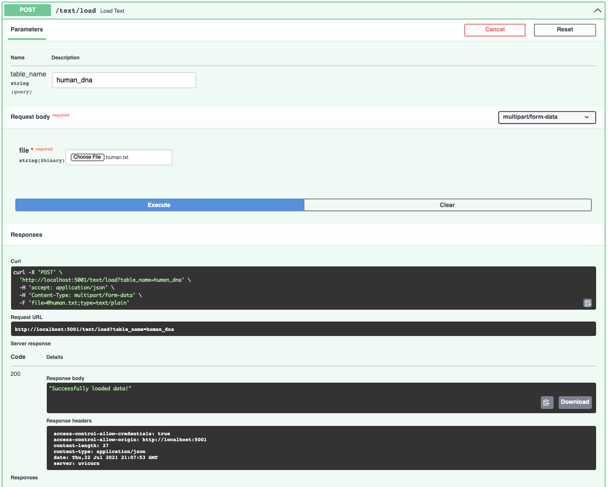
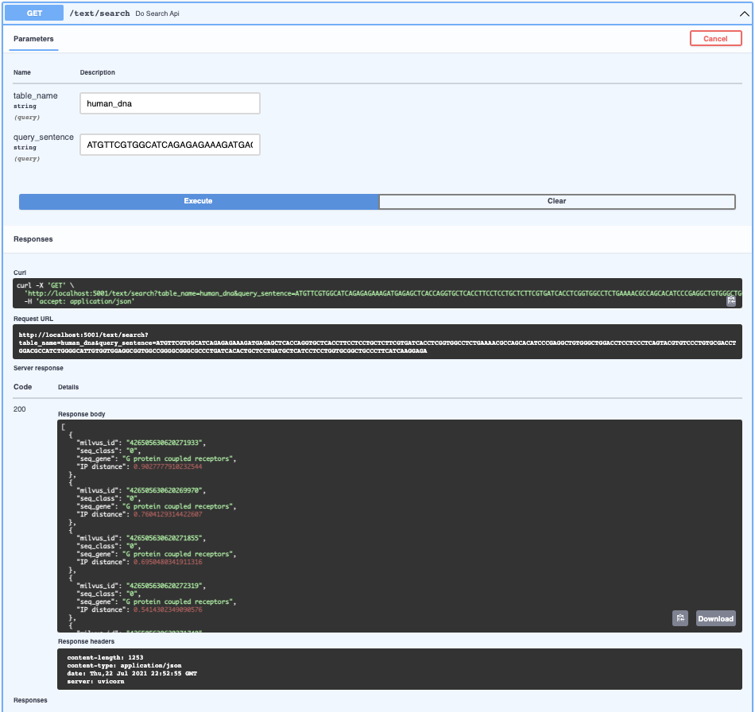

## README

This project builds a DNA sequence classification system with Milvus. In this project, k-mer & CountVectorizer is used to convert the original DNA sequence into a fixed-length vector and store it in Milvus. The system classifies DNA sequence entered by user through searching for most similar sequences in Milvus and recalling classes (gene family names) from Mysql.

### Data source

The dataset required to build this system has to be a **TXT** file, which can be read as dataframe with 2 columns: **sequence, class**. (See example: /src/data/test.txt)

A **TXT** file is also required to indicate what gene family each class represents, including 2 dataframe columns: **class, gene_family**. (See example: /src/data/gene_class.txt)

## How to deploy the system

### 1. Start Milvus and MySQL

The system will use Milvus to store sequence vectors with auto-generated ids in a collection and perform similarity search.

Mysql stores sequence ids in Milvus and corresponding classes. It also includes the correspondence between class labels and gene family names.

- **Start Milvus v2.0**

Refer to [Install Milvus v2.0](https://milvus.io/docs/v2.0.0/install_standalone-docker.md) for how to run Milvus docker.

```
$ wget https://raw.githubusercontent.com/milvus-io/milvus/master/deployments/docker/standalone/docker-compose.yml -O docker-compose.yml
$ sudo docker-compose up -d
Docker Compose is now in the Docker CLI, try `docker compose up`
Creating milvus-etcd  ... done
Creating milvus-minio ... done
Creating milvus-standalone ... done

```

> Note the version of Milvus.

- **Start MySQL**

```
$ docker run -p 3306:3306 -e MYSQL_ROOT_PASSWORD=123456 -d mysql:5.7
```

### 2. Start Server

The next step is to start the system server. It provides HTTP backend services, and there are two ways to start: running with Docker or source code.

#### 2.2 Run source code

- **Install the Python packages**

```
$ cd server
$ pip install -r requirements.txt
```

- **Set configuration**

```
$ vim server/src/config.py
```

Please modify the parameters according to your own environment. Here listing some parameters that need to be set, for more information please refer to [config.py](https://github.com/miia12/bootcamp/blob/master/solutions/reverse_image_search/quick_deploy/server/src/config.py).

| **Parameter**    | **Description**                                       | **Default setting**    |
| ---------------- | ----------------------------------------------------- | ---------------------- |
| MILVUS_HOST      | The IP address of Milvus, you can get it by ifconfig. | 'localhost'            |
| MILVUS_PORT      | Port of Milvus.                                       | 19530                  |
| VECTOR_DIMENSION | Dimension of the vectors.                             | 768                    |
| MYSQL_HOST       | The IP address of Mysql.                              | 'localhost'            |
| MYSQL_PORT       | Port of Milvus.                                       | 3306                   |
| DEFAULT_TABLE    | The milvus and mysql default collection name.         | 'dna_sequence'         |
| MODEL_PATH       | File path to save CountVectorizer trained             | './vectorizer.pkl'     |
| KMER_K           | k for k-mer                                           | 4                      |
| SEQ_CLASS_PATH   | File path of txt file for class meanings              | './data/gene_class.txt'|


- **Run the code**

Start the server with Fastapi.

```
$ cd src
$ python main.py
```
- **Code  structure**

  If you are interested in our code or would like to contribute code, feel free to learn more about our code structure.

  ```
  └───server
  │   │   Dockerfile
  │   │   requirements.txt
  │   │   main.py  # File for starting the program.
  │   │
  │   └───src
  │       │   config.py  # Configuration file.
  │       │   utils.py  # Process DNA sequences: k-mer, fit CountVectorizer, convert data to embeddings.
  │       │   milvus_helpers.py  # Connect to Milvus server and insert/drop/query vectors in Milvus.
  │       │   mysql_helpers.py   # Connect to MySQL server, and add/delete/query IDs and object information.
  │       │   
  │       └───operations # Call methods in milvus_helpers.py and mysql_helpers.py to insert/search/delete/count objects.
  │               │   load.py
  │               │   search.py
  │               │   drop.py
  │               │   count.py
  ```


- **API docs** 

Vist localhost:5001/docs in your browser to use all the APIs.


**/text/load_data**

This API is used to import datasets into the system.
A successful import will have
- a Milvus collection with vectors & auto_ids
- a Mysql table with milvus_ids & classes
- a pickle file saved for fitted vectorizer
    


**/text/search**

This API is used to get class, gene family, inner product distance for topK similar DNA sequences in the system.
* Enter the Milvus collection name to search through
* Input a DNA sequence to search for (eg. ATGTTCGTGGCATCAGAGAGAAAGATGAGAGCTCACCAGGTGCTCACCTTCCTCCTGCTCTTCGTGATCACCTCGGTGGCCTCTGAAAACGCCAGCACATCCCGAGGCTGTGGGCTGGACCTCCTCCCTCAGTACGTGTCCCTGTGCGACCTGGACGCCATCTGGGGCATTGTGGTGGAGGCGGTGGCCGGGGCGGGCGCCCTGATCACACTGCTCCTGATGCTCATCCTCCTGGTGCGGCTGCCCTTCATCAAGGAGA)



**/text/count**

This API is used to get the number of the DNA sequences in the system.

**/text/drop**

This API is used to delete a specified collection.


